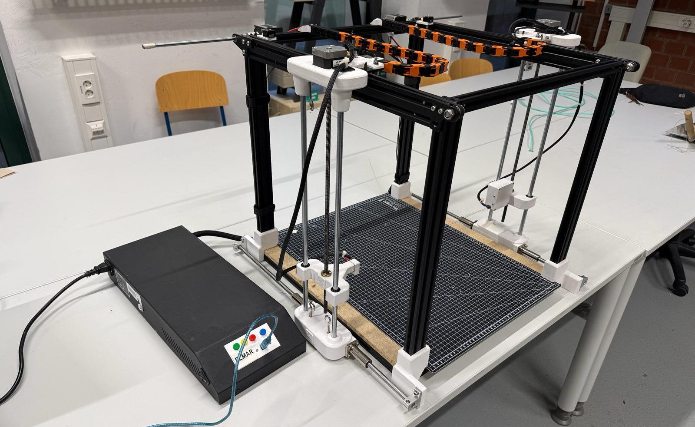

## AT-SS25-ELMAR
# ELMAR CNC-Cutter

# Betreuer: Prof. Dr. Elmar Wings

# Autoren (Name, Vorname, Matrikelnummer):

1. Roth, Alexandra, 7025637
2. Atrops, David, 7013979
3. Smirnow, Dennis, 7023434
4. Ronge, Leon, 7026641
5. Drees, Samuel, 7026354

# ELMAR CNC-Cutter

# Projektbeschreibung und Problembeschreibung:

ELMAR ist ein CNC-gesteuerter Heißdrahtschneider zum Schneiden von Styropor und anderen geeigneten Schaumstoffen. Die Maschine wird über einen Arduino Uno mit GRBL-Firmware gesteuert und über den Universal G-Code Sender (UGS) vom Laptop aus bedient. Vorhandene G-Code-Dateien werden an die Steuerung übertragen, sodass der erhitzte Schneiddraht automatisch entlang der vorgegebenen Kontur verfährt.

Die zentrale Aufgabenstellung besteht darin, mechanische Achsbewegung, elektrische Heizdrahtansteuerung und Softwarebedienung zu einem funktionierenden Gesamtsystem zu verbinden. Dabei müssen die Achsen zuverlässig verfahren, die Endschalter für die Referenzfahrt korrekt eingebunden und der Heizdraht sicher angesteuert werden. Zusätzlich soll das System verständlich dokumentiert werden, damit Aufbau, Bedienung, Wartung und Fehlersuche nachvollziehbar bleiben.

Besondere Herausforderungen ergeben sich aus der Abstimmung von Vorschubgeschwindigkeit, Heizdrahttemperatur und Materialbefestigung. Nur wenn diese Punkte zusammenpassen, entsteht ein sauberer Schnitt. Außerdem müssen Sicherheitsaspekte wie Verbrennungsgefahr am Heizdraht, freie Achsbewegung und das Verhalten im Fehlerfall berücksichtigt werden.

# Verzeichnisstruktur:

## AssumptionOfLiability
- [AssumptionOfLiability](report/AssumptionOfLiability)
  - Ordner mit den Dokumenten zum Haftungsausschluss
  - Root-Dokument: [AssumptionOfLiability.tex](report/AssumptionOfLiability/AssumptionOfLiability.tex)
  - PDF-Datei: [AssumptionOfLiability.pdf](report/AssumptionOfLiability/AssumptionOfLiability.pdf)

## Code
- [Code](report/Code)
  - Ordner mit Arduino-Testprogrammen und Funktionsbeispielen
  - Enthält unter anderem Tests für A4988-Treiber, CNC-Shield, Endschalter, OLED, MOSFET und Referenzfahrt
  - Beispiele:
    - [A4988DriverTest](report/Code/A4988DriverTest/A4988DriverTest.ino)
    - [CNCShieldFunctionTest](report/Code/CNCShieldFunctionTest/CNCShieldFunctionTest.ino)
    - [MosfetHotwireTest](report/Code/MosfetHotwireTest/MosfetHotwireTest.ino)
    - [OledFunktionsTest](report/Code/OledFunktionsTest/OledFunktionsTest.ino)
    - [referenzfahrt](report/Code/referenzfahrt/referenzfahrt.ino)

## Contents
- [Contents](report/Contents)
  - Ordner mit den LaTeX-Kapiteln der technischen Dokumentation
  - Enthält Kapitel zu Hardware, Software, Arduino, CNC-Shield, Endschaltern, Schrittmotoren, OLED und dem Gesamtsystem
  - Wichtige Dateien:
    - [Einleitung.tex](report/Contents/General/Einleitung.tex)
    - [KomplettesSystem.tex](report/Contents/General/KomplettesSystem.tex)
    - [ArduinoUnoR3.tex](report/Contents/General/ArduinoUnoR3.tex)
    - [CNCShieldV3.tex](report/Contents/General/CNCShieldV3.tex)
    - [Endschalter.tex](report/Contents/General/Endschalter.tex)
    - [StepperDrive.tex](report/Contents/General/StepperDrive.tex)
    - [OledSSD1306.tex](report/Contents/General/OledSSD1306.tex)

## General
- [General](report/General)
  - Ordner mit allgemeinen LaTeX-Dateien für die Dokumentation
  - Enthält Pakete, Befehle, Abkürzungen, Trennungen, TikZ-Definitionen und das Projektlogo
  - Beispiele:
    - [packages.tex](report/General/packages.tex)
    - [commands.tex](report/General/commands.tex)
    - [acronyms.tex](report/General/acronyms.tex)
    - [Logo.png](report/General/Logo.png)

## Images
- [Images](report/Images)
  - Ordner mit Bildern und Abbildungen für die Dokumentation
  - Enthält Bilder zu Arduino, CNC-Shield, Schrittmotoren, Endschaltern, OLED, MOSFET, Heizdraht und weiteren Bauteilen
  - Wichtige Unterordner:
    - [Arduino](report/Images/Arduino)
    - [General](report/Images/General)
    - [Maple](report/Images/Maple)

## Literature
- [Literature](report/Literature)
  - Ordner mit Literatur, Quellen, Datenblättern und Präsentationsunterlagen
  - Enthält eigene Quellen sowie bereitgestellte Literatur
  - Wichtige Unterordner:
    - [Unsere Literatur](report/Literature/Unsere%20Literatur)
    - [Wings Literature](report/Literature/Wings%20Literature)
    - [slides](report/Literature/slides)
  - Root-Dokument: [LiteratureReview.tex](report/Literature/LiteratureReview.tex)

## Manuals
- [Manuals](report/Manuals)
  - Ordner mit dem Handbuch zum ELMAR CNC-Cutter
  - Root-Dokument: [Handbuch-Elmar.tex](report/Manuals/Handbuch-Elmar/Handbuch-Elmar.tex)
  - PDF-Datei: [Handbuch-Elmar.pdf](report/Manuals/Handbuch-Elmar/Handbuch-Elmar.pdf)

## Poster
- [Poster](report/Poster)
  - Ordner mit dem Projektposter und den dazugehörigen Bildern
  - Root-Dokument: [tikzposter.tex](report/Poster/tikzposter.tex)
  - PDF-Datei: [tikzposter.pdf](report/Poster/tikzposter.pdf)
  - Bilder: [images](report/Poster/images)

## ProjectManagement
- [ProjectManagement](report/ProjectManagement)
  - Ordner mit Projektmanagement-Unterlagen und Hilfsdokumenten
  - Enthält unter anderem Checklisten, Git-Unterlagen, LaTeX-Hinweise und Bewertungsdateien
  - Beispiele:
    - [Checklist.xlsx](report/ProjectManagement/Checklist.xlsx)
    - [EvaluationHW.xlsx](report/ProjectManagement/EvaluationHW.xlsx)
    - [LaTeXGuide.pdf](report/ProjectManagement/LaTeXGuide.pdf)
    - [GitHub-Die Basis.pdf](report/ProjectManagement/GitHub-Die%20Basis.pdf)

## Schnelleinstieg
- [Schnelleinstieg.tex](report/Schnelleinstieg.tex)
  - Kurzanleitung zur Bedienung des ELMAR CNC-Cutters über UGS
  - PDF-Datei: [Schnelleinstieg.pdf](report/Schnelleinstieg.pdf)

## Software
- [Software](report/Software)
  - Ordner mit softwarebezogenen Informationen und Links
  - Enthält unter anderem einen Link zur verwendeten Webanwendung
  - Datei: [Website.md](report/Software/Software%20Link/Website.md)

## System
- [System](report/System)
  - Ordner mit systembezogener Dokumentation
  - Enthält Unterlagen zum EdgeComputer
  - Root-Dokument: [Doku Elmar.tex](report/System/EdgeComputer/Doku%20Elmar.tex)
  - PDF-Datei: [Doku Elmar.pdf](report/System/EdgeComputer/Doku%20Elmar.pdf)

## tikz
- [tikz](report/tikz)
  - Ordner mit TikZ-Zeichnungen und selbst erstellten Abbildungen
  - Enthält unter anderem Darstellungen zum Aufbau, zur Software, zu Endschaltern und Troubleshooting
  - Beispiele:
    - [Front.tex](report/tikz/Eigene_Bilder/Front.tex)
    - [Software.tex](report/tikz/Eigene_Bilder/Software.tex)
    - [Micro_Switch.tex](report/tikz/Eigene_Bilder/Micro_Switch.tex)
    - [Troubleshooting](report/tikz/Eigene_Bilder/Troubleshooting)

## Papierkorb
- [Papierkorb](report/Papierkorb)
  - Ordner mit älteren oder nicht mehr verwendeten Dateien
  - Diese Dateien dienen nur als Ablage und sind nicht Bestandteil der finalen Dokumentation
